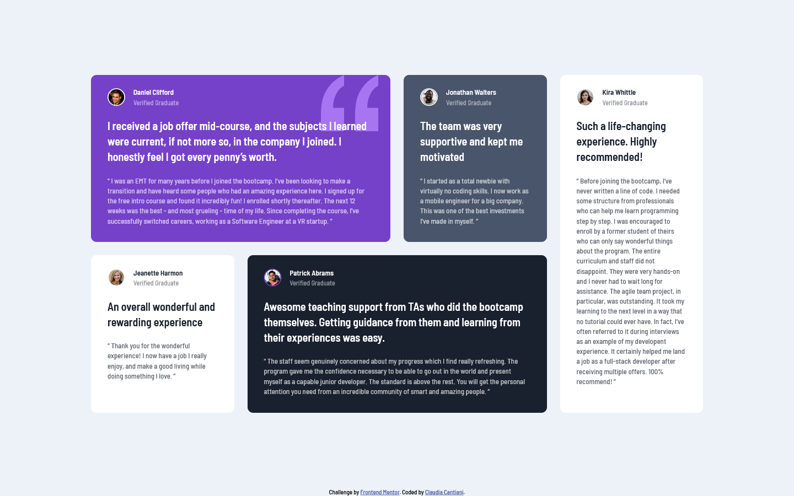

# Frontend Mentor - Testimonials grid section solution

This is a solution to the [Testimonials grid section challenge on Frontend Mentor](https://www.frontendmentor.io/challenges/testimonials-grid-section-Nnw6J7Un7). Frontend Mentor challenges help you improve your coding skills by building realistic projects.

## Table of contents

- [Overview](#overview)
  - [The challenge](#the-challenge)
  - [Screenshot](#screenshot)
  - [Links](#links)
- [My process](#my-process)
  - [Built with](#built-with)
  - [What I learned](#what-i-learned)
  - [Continued development](#continued-development)
  - [Useful resources](#useful-resources)
- [Author](#author)
- [Acknowledgments](#acknowledgments)

## Overview

### The challenge

Users should be able to:

- View the optimal layout for the site depending on their device's screen size

### Screenshot

### Links

- Solution URL: [Add solution URL here](https://your-solution-url.com)
- Live Site URL: [Add live site URL here](https://cla91.github.io/testimonials-grid-section-main/)

## My process

### Built with

- Semantic HTML5 markup
- SASS
- CSS Grid
- Mobile-first workflow

### What I learned

It's my first time using SASS, so I just tried a cuple of things to understand how they worked. The CSS looks a bit messy with all the :nth-child(), maybe I should have used more classes.

## Author

- Frontend Mentor - [@cla91](https://www.frontendmentor.io/profile/cla91)
